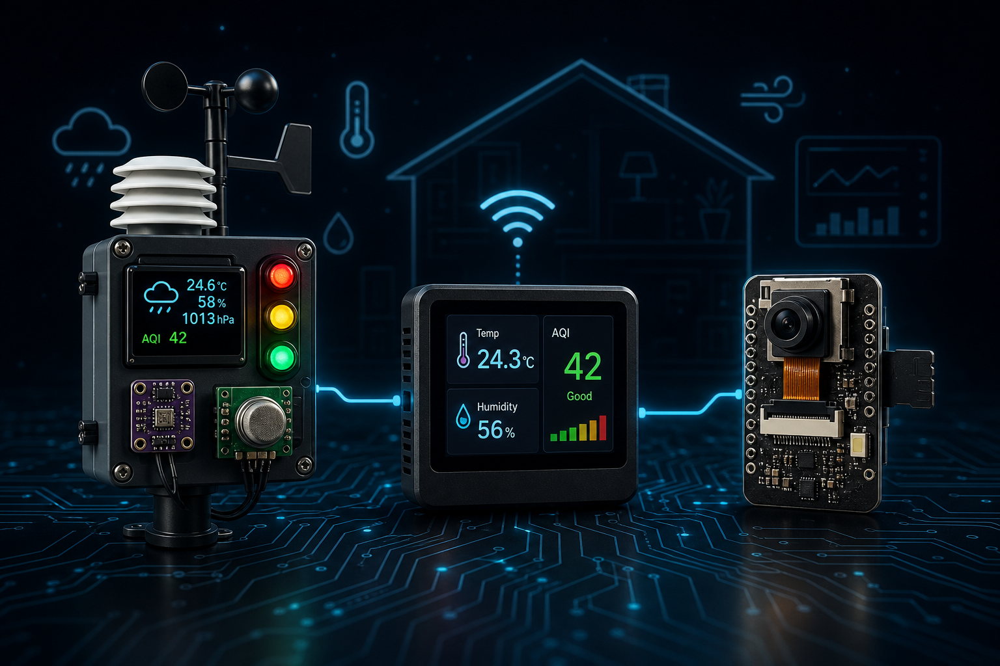
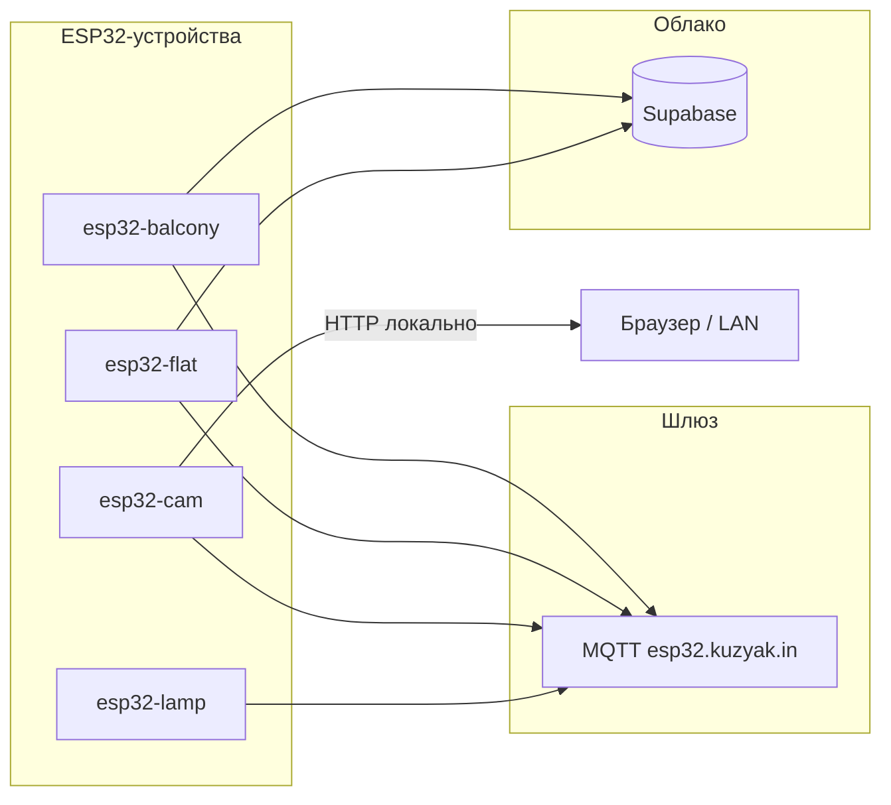

# Arduino / ESP32 Projects

Домашние проекты на ESP32: мониторинг климата и качества воздуха, комнатный дисплей и камера с локальным архивом снимков. Все устройства публикуют телеметрию на MQTT-шлюз `esp32.kuzyak.in` (Mosquitto на Raspberry Pi).

## Архитектура


```mermaid
flowchart LR
  subgraph devices [ESP32-устройства]
    B[esp32-balcony]
    F[esp32-flat]
    C[esp32-cam]
    L[esp32-lamp]
  end

  subgraph hub [Шлюз]
  M[MQTT esp32.kuzyak.in]
  end

  subgraph cloud [Облако]
  S[(Supabase)]
  end

  B --> M
  F --> M
  C --> M
  L --> M
  B --> S
  F --> S
  C -->|HTTP локально| U[Браузер / LAN]
```

| Топик | Назначение |
|-------|------------|
| `devices/<hostname>/status` | Online/offline (LWT) |
| `devices/<hostname>/telemetry` | Периодическая телеметрия (каждые 10 с) |
| `devices/<hostname>/command` | JSON-команды на устройство |
| `devices/<hostname>/capabilities` | Retained JSON с описанием команд (для админки) |

Общий формат команды: `{"action": "...", "value": ...}` (поле `value` — только где нужно).

## Проекты

### 1. esp32_balcony_pms5003_bme280 — Балконная метеостанция

ESP32 DevKit + BME280 + PMS5003 + OLED SSD1306 128×64 + RGB-светофор.

| Датчик | Параметры |
|--------|-----------|
| **BME280** | Температура, влажность, давление |
| **PMS5003** | PM1.0, PM2.5, PM10 (серия до 30 замеров со статистикой: min, max, median, mean, stddev) |

**Расписание замеров:**
- Климат — в буфер каждые **30 с**, отправка в Supabase каждые **5 мин** (медиана из 10 значений)
- Пыль — цикл каждые **30 мин**: 30 с прогрев лазера → 30 с серия замеров (1 с между чтениями)

**OLED SSD1306** — 5 страниц с автопереключением каждые 5 с:
- **KLIMA** — показания BME280 + таймер следующего замера
- **PYL** — PM1/2.5/10 + расписание PMS
- **CLOUD** — отправка в Supabase + счётчик ошибок
- **HW** — состояние датчиков, Wi-Fi, IP
- **SYS** — температура CPU, uptime, heap, причина ребута

При ошибке BME280 или PMS на дисплее показывается экран **ALERT!**.

**RGB-светофор** — цвет по уровню PM2.5:
- Зелёный: ≤12 мкг/м³
- Жёлтый: ≤35 мкг/м³
- Красный: >35 мкг/м³

**Отправка данных:**
- **Supabase** — климат + пыль каждые 5 минут
- **MQTT** — телеметрия и команды на шлюз

**Удалённый мониторинг:** MQTT-команды. Локального HTTP-интерфейса нет.

**Надёжность:**
- Hardware Watchdog (30 с)
- Суточный профилактический ребут
- Ребут при потере Wi-Fi >10 минут
- Детекция залипшего BME280 (10 одинаковых показаний подряд → алерт + ребут)
- Детекция залипшего PMS5003 (6 одинаковых медиан подряд → алерт + ребут)
- Счётчик ошибок Supabase с алертом после 3 подряд
- Кольцевой лог событий (15) и ошибок (10) в RAM; ошибки также в RTC

**MQTT-команды:**

| action | Описание |
|--------|----------|
| `led` + `value: bool` | Встроенный LED платы (GPIO 2) |
| `reboot` | Перезагрузка |
| `status` | Показать страницу HW на OLED |
| `ota` + `url: string` | OTA-обновление прошивки по HTTP(S) |

**Пины:**

| Компонент | GPIO |
|-----------|------|
| PMS5003 RX | 16 |
| PMS5003 TX | 17 |
| BME280 I²C | стандарт (адрес 0x76) |
| OLED SDA | 18 |
| OLED SCL | 19 |
| LED R | 25 |
| LED G | 26 |
| LED Y | 27 |
| LED встроенный | 2 |

**Плата:** ESP32 Dev Module, Partition = **Default** (4MB with spiffs, OTA).

---

### 2. esp32_flat_bme280 — Комнатный дисплей

ESP32 DevKit + BME280 + 1.8" TFT ST7735 + джойстик.

- Показывает температуру, влажность, давление (локальные и с балкона через Supabase)
- AQI-индекс (EPA) на основе PM2.5/PM10 с балкона
- Экраны: **Home**, **Outdoor**, **AQI**
- Оверлеи: **Time** (кнопка джойстика), **System info** (вниз на джойстике)
- Навигация джойстиком (лево/право — экраны, кнопка — часы, вниз — info)
- EMA-фильтр показаний BME280 (α=0.1)
- Отправка локальных данных в Supabase каждые 10 минут
- Загрузка уличных данных из Supabase каждые 10 минут
- **MQTT** — телеметрия на шлюз

**Удалённый мониторинг:** MQTT. Локального HTTP-интерфейса нет.

**MQTT-команды:**

| action | Описание |
|--------|----------|
| `led` + `value: bool` | Встроенный LED платы (GPIO 2) |
| `reboot` | Перезагрузка |
| `status` | Показать экран System info |
| `refresh` | Принудительно обновить данные с балкона |
| `ota` + `url: string` | OTA-обновление прошивки по HTTP(S) |

**Пины:**

| Компонент | GPIO |
|-----------|------|
| TFT CS | 5 |
| TFT DC | 2 |
| TFT RST | 4 |
| TFT SCLK | 18 |
| TFT MOSI | 23 |
| BME280 SDA | 21 |
| BME280 SCL | 22 |
| Joystick X | 34 |
| Joystick Y | 35 |
| Joystick SW | 32 |

**Плата:** ESP32 Dev Module, Partition = **Default** (4MB with spiffs, OTA).

---

### 3. esp32_cam — Камера с фото на SD

AI-Thinker ESP32-CAM + microSD.

- Снимок каждые **15 секунд**, сохранение JPEG на microSD (`/photos/00000.jpg` … `00479.jpg`)
- Кольцевая ротация: 480 кадров (~2 часа), старые перезаписываются
- Разрешение **SVGA** (800×600), JPEG quality 10–12
- **MQTT** — телеметрия и команды через шлюз
- **HTTP** — статус-страница и раздача фото:
  - `http://esp32-cam.local/` — статус + превью (автообновление 10 с)
  - `http://esp32-cam.local/latest.jpg` — последний кадр
  - `http://esp32-cam.local/photo?id=N` — кадр по индексу (0–479)

**MQTT-команды:**

| action | Описание |
|--------|----------|
| `capture` | Внеочередной снимок |
| `reboot` | Перезагрузка |
| `led` + `value: bool` | Вспышка (GPIO 4) |
| `ota` + `url: string` | OTA-обновление прошивки по HTTP(S) |

**Пины (встроенные на плате):**

| Компонент | GPIO |
|-----------|------|
| Камера OV2640 | 0, 5, 18–23, 25–27, 32, 34–39 |
| microSD (1-bit) | CLK 14, CMD 15, D0 2 |
| Вспышка | 4 |

**Прошивка:** Board = **AI Thinker ESP32-CAM**, Partition = **Default** (4MB with spiffs, OTA). microSD — **FAT32**.

---

### 4. esp32_lamp — Управление светом

ESP32 DevKit + LED-лампа на **2 провода** (красный/чёрный).

**Подключение:**

| Лампа | ESP32 |
|-------|-------|
| + (красный) | **GPIO 13** |
| − (чёрный) | **GND** |

Если лампа слишком яркая или греет GPIO — резистор **100–330 Ω** между GPIO 13 и «+».

> Не вешайте на VIN/GND — с двумя проводами это только постоянное питание, без управления.

- **MQTT** — телеметрия и команды на шлюз
- OTA-обновление прошивки
- Автопереподключение Wi-Fi

**MQTT-команды:**

| action | Описание |
|--------|----------|
| `light` или `lamp` + `value: bool/int` | Включить/выключить лампу (GPIO 13) |
| `pin_write` + `pin: 13`, `value: 0/1` | То же через GPIO (как на других устройствах) |
| `pin_read` + `pin: N` | Прочитать пин, ответ в telemetry |
| `pin_mode` + `pin`, `mode` | `OUTPUT` / `INPUT` / `INPUT_PULLUP` |
| `led` + `value: bool` | Встроенный LED платы (GPIO 2) |
| `reboot` | Перезагрузка |
| `ota` + `url: string` | OTA-обновление прошивки по HTTP(S) |

**Пины:**

| Компонент | GPIO |
|-----------|------|
| Лампа + | 13 |
| Лампа − | GND |
| LED встроенный | 2 |

**Плата:** ESP32 Dev Module, Partition = **Default** (4MB with spiffs, OTA).

## Настройка

### 1. Секреты

Скопируйте `secrets.example.h` → `secrets.h` в папке нужного проекта и заполните:

| Проект | Wi-Fi | MQTT | Supabase |
|--------|-------|------|----------|
| esp32_balcony | ✓ | ✓ | ✓ |
| esp32_flat | ✓ | ✓ | ✓ |
| esp32_cam | ✓ | ✓ | — |
| esp32_lamp | ✓ | ✓ | — |

`DEVICE_HOSTNAME` используется как имя в роутере и как MQTT device id.

### 2. Библиотеки (Arduino Library Manager)

| Библиотека | Балкон | Комната | Камера | Лампа |
|------------|:------:|:-------:|:------:|:-----:|
| Adafruit BME280 Library | ✓ | ✓ | | |
| Adafruit GFX Library | ✓ | ✓ | | |
| Adafruit SSD1306 | ✓ | | | |
| Adafruit ST7735 and ST7789 Library | | ✓ | | |
| PMS Library | ✓ | | | |
| ArduinoJson | ✓ | ✓ | ✓ | ✓ |
| PubSubClient | ✓ | ✓ | ✓ | ✓ |

Камера использует встроенные `esp_camera` и `SD_MMC` (ESP32 Arduino core).

### 3. Прошивка

**Через USB (Arduino IDE):**

1. Откройте `.ino` в Arduino IDE
2. Выберите плату и схему разделов (см. разделы проектов выше)
3. Загрузите прошивку

**OTA (по MQTT):**

Все устройства поддерживают удалённое обновление через HTTP(S). Команда на топик `devices/<hostname>/command`:

```json
{"action": "ota", "url": "https://example.com/ota/esp32-flat.bin"}
```

Устройство скачивает `.bin`, прошивает OTA-слот и перезагружается. Прогресс публикуется в телеметрии (`ota`: `starting` → `downloading` → `complete` / `failed`).

> **Важно:** для OTA нужна схема разделов с двумя слотами приложения (`app0` + `app1`). Схема **Huge APP** OTA не поддерживает. Если устройство прошито через USB со схемой Huge APP — один раз перепрошейте по USB с **Default**, дальше обновления пойдут по OTA.

### 4. Сборка OTA-бинарников

Скрипт `scripts/build-ota.sh` собирает прошивки через `arduino-cli` (из PATH или из Arduino IDE) и кладёт готовые `.bin` в `ota/`. Имя файла: `<устройство>-<версия>-<дата>.bin` (версия из `firmware_info.h`, дата — день сборки).

| Цель | Плата | Partition | Пример файла |
|------|-------|-----------|--------------|
| `flat` | ESP32 Dev Module | Default | `ota/esp32-flat-1.1.0-20260704.bin` |
| `balcony` | ESP32 Dev Module | Default | `ota/esp32-balcony-1.1.0-20260704.bin` |
| `cam` | AI Thinker ESP32-CAM | Default | `ota/esp32-cam-1.1.0-20260704.bin` |
| `lamp` | ESP32 Dev Module | Default | `ota/esp32-lamp-1.1.0-20260704.bin` |

```bash
./scripts/build-ota.sh              # все проекты
./scripts/build-ota.sh flat         # только комнатный дисплей
./scripts/build-ota.sh balcony cam  # балкон + камера
```

Требуется `secrets.h` в папке проекта. Для OTA нужен только файл приложения (`.ino.bin`), не полный образ flash.

Переменная `ARDUINO_CLI` переопределяет путь к CLI, если он не в PATH и Arduino IDE установлена нестандартно.

## Структура репозитория

```
arduino/
├── assets/
│   └── hero.png                    # Обложка README
├── scripts/
│   └── build-ota.sh                # Сборка OTA-бинарников
├── ota/                            # Готовые .bin для OTA (.gitignore)
├── esp32_balcony_pms5003_bme280/   # Балконная метеостанция
│   ├── esp32_balcony_pms5003_bme280.ino
│   ├── build/                      # Артефакты компиляции (.gitignore)
│   ├── secrets.h                   # (.gitignore)
│   └── secrets.example.h
├── esp32_flat_bme280/              # Комнатный дисплей
│   ├── esp32_flat_bme280.ino
│   ├── build/                      # (.gitignore)
│   ├── secrets.h                   # (.gitignore)
│   └── secrets.example.h
├── esp32_cam/                      # ESP32-CAM, фото на SD
│   ├── esp32_cam.ino
│   ├── build/                      # (.gitignore)
│   ├── secrets.h                   # (.gitignore)
│   └── secrets.example.h
├── esp32_lamp/                     # Управление светом по MQTT
│   ├── esp32_lamp.ino
│   ├── build/                      # (.gitignore)
│   ├── secrets.h                   # (.gitignore)
│   └── secrets.example.h
├── libraries/                      # Локальные библиотеки (.gitignore)
├── .gitignore
└── README.md
```
