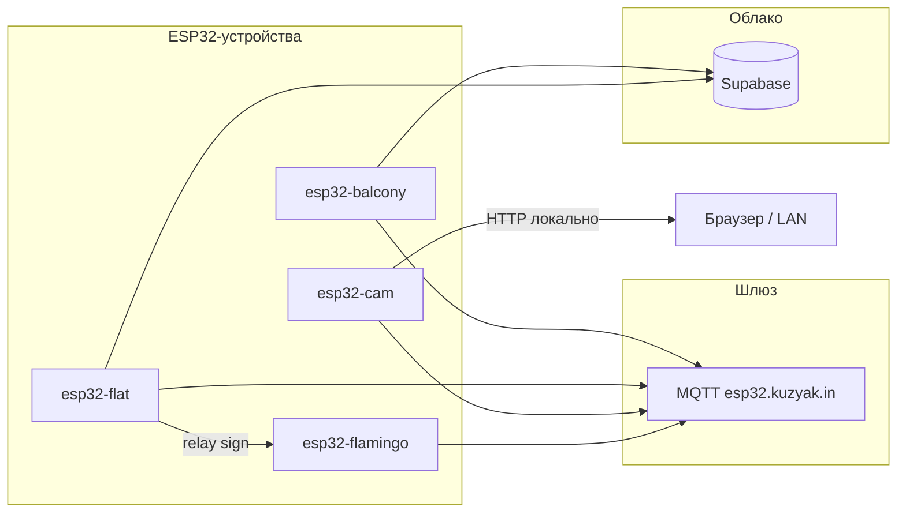

# Arduino / ESP32 Projects

Домашние проекты на ESP32: мониторинг климата и качества воздуха, комнатный дисплей, камера с локальным архивом снимков, свет в спальне и декоративная вывеска. Все устройства публикуют телеметрию на MQTT-шлюз `esp32.kuzyak.in` (Mosquitto на Raspberry Pi).

## Архитектура


```mermaid
flowchart LR
  subgraph devices [ESP32-устройства]
    B[esp32-balcony]
    F[esp32-flat]
    C[esp32-cam]
    FG[esp32-flamingo]
  end

  subgraph hub [Шлюз]
  M[MQTT esp32.kuzyak.in]
  end

  subgraph cloud [Облако]
  S[(Supabase)]
  end

  B --> M
  F --> M
  C --> M
  FG --> M
  F -->|relay sign| FG
  B --> S
  F --> S
  C -->|HTTP локально| U[Браузер / LAN]
```

| Топик | Назначение |
|-------|------------|
| `devices/<hostname>/status` | Online/offline (LWT) |
| `devices/<hostname>/telemetry` | Телеметрия: каждые 10 с + сразу при смене состояния |
| `devices/<hostname>/command` | JSON-команды на устройство |
| `devices/<hostname>/capabilities` | Retained JSON с описанием команд (для админки) |
| `devices/esp32-flat/out/flamingo` | Relay flat → flamingo (кнопка вывески) |

Общий формат команды: `{"action": "...", "value": ...}` (поле `value` — только где нужно).

**Синхронизация состояния:** после любой toggle-команды (`led`, `light`, `sign`, `garland` …) и при MQTT-подключении устройство **сразу** публикует телеметрию — дашборд не ждёт до 10 с. Встроенный LED (GPIO 2) **выключен по умолчанию**; если UI показывает «вкл» после ребута — это устаревшее значение до первого пакета.

## Проекты

**Плата:** ESP32 Dev Module, Partition = **Default** (4MB with spiffs, OTA).

---

### 0. esp32_default — Универсальная прошивка по умолчанию

Базовая прошивка для **любой новой ESP32 DevKit** без датчиков и периферии.

- Wi-Fi + MQTT сразу после прошивки
- Телеметрия каждые 10 с (IP, RSSI, uptime, heap, версия)
- Watchdog 30 с, автопереподключение Wi-Fi
- OTA — можно сразу обновить на целевую прошивку (flat, flamingo, …)

**MQTT-команды:**

| action | Описание |
|--------|----------|
| `led` + `value: bool` | Встроенный LED платы (GPIO 2); телеметрия сразу |
| `status` | Немедленно опубликовать телеметрию |
| `reboot` | Перезагрузка |
| `ota` + `url: string` | OTA-обновление по HTTP(S) |
| `pin_mode` + `pin`, `mode` | `OUTPUT` / `INPUT` / `INPUT_PULLUP` |
| `pin_write` + `pin`, `value` | Цифровой 0/1 или PWM 0–255 |
| `pin_read` + `pin` | Чтение пина → ответ в telemetry |

**Быстрый старт:**

1. Скопируйте `secrets.example.h` → `secrets.h`, задайте Wi-Fi и `DEVICE_HOSTNAME`
2. Плата: **ESP32 Dev Module**, Partition = **Default**
3. Прошейте `esp32_default.ino` по USB
4. Проверьте в MQTT: `devices/<hostname>/status` → online

**Плата:** ESP32 Dev Module, Partition = **Default**.

---

### 1. esp32_balcony_pms5003_bme280 — Балконная метеостанция

ESP32 DevKit + BME280 + PMS5003 + OLED SSD1306 128×64 + RGB-светофор.

| Датчик | Параметры |
|--------|-----------|
| **BME280** | Температура, влажность, давление |
| **PMS5003** | PM1.0, PM2.5, PM10 (серия до 30 замеров со статистикой: min, max, median, mean, stddev) |

**Расписание замеров:**
- Климат — в буфер каждые **30 с**, отправка в Supabase каждые **5 мин** (медиана из 10 значений)
- Пыль — цикл каждые **30 мин**: 30 с прогрев лазера → 30 с серия замеров (1 с между чтениями)

**OLED SSD1306** — 5 страниц с автопереключением каждые 5 с:
- **KLIMA** — показания BME280 + таймер следующего замера
- **PYL** — PM1/2.5/10 + расписание PMS
- **CLOUD** — отправка в Supabase + счётчик ошибок
- **HW** — состояние датчиков, Wi-Fi, IP
- **SYS** — температура CPU, uptime, heap, причина ребута

При ошибке BME280 или PMS на дисплее показывается экран **ALERT!**.

**RGB-светофор** — цвет по уровню PM2.5:
- Зелёный: ≤12 мкг/м³
- Жёлтый: ≤35 мкг/м³
- Красный: >35 мкг/м³

**Отправка данных:**
- **Supabase** — климат + пыль каждые 5 минут
- **MQTT** — телеметрия и команды на шлюз

**Удалённый мониторинг:** MQTT-команды. Локального HTTP-интерфейса нет.

**Надёжность:**
- Hardware Watchdog (30 с)
- Суточный профилактический ребут
- Ребут при потере Wi-Fi >10 минут
- Детекция залипшего BME280 (10 одинаковых показаний подряд → алерт + ребут)
- Детекция залипшего PMS5003 (6 одинаковых медиан подряд → алерт + ребут)
- Счётчик ошибок Supabase с алертом после 3 подряд
- Кольцевой лог событий (15) и ошибок (10) в RAM; ошибки также в RTC

**MQTT-команды:**

| action | Описание |
|--------|----------|
| `led` + `value: bool` | Встроенный LED платы (GPIO 2); телеметрия сразу |
| `reboot` | Перезагрузка |
| `status` | Показать страницу HW на OLED |
| `ota` + `url: string` | OTA-обновление прошивки по HTTP(S) |

**Пины:**

| Компонент | GPIO |
|-----------|------|
| PMS5003 RX | 16 |
| PMS5003 TX | 17 |
| BME280 I²C | стандарт (адрес 0x76) |
| OLED SDA | 18 |
| OLED SCL | 19 |
| LED R | 25 |
| LED G | 26 |
| LED Y | 27 |
| LED встроенный | 2 |

**Плата:** ESP32 Dev Module, Partition = **Default** (4MB with spiffs, OTA).

---

### 2. esp32_flat_bme280 — Комнатный дисплей

ESP32 DevKit + BME280 + 1.8" TFT ST7735 + джойстик.

- Показывает температуру, влажность, давление (локальные и с балкона через Supabase)
- AQI-индекс (EPA) на основе PM2.5/PM10 с балкона
- Экраны: **Home**, **Outdoor**, **AQI**
- Оверлеи: **Time** (кнопка джойстика), **System info** (вниз на джойстике)
- Навигация джойстиком (лево/право — экраны, кнопка — часы, вниз — info)
- EMA-фильтр показаний BME280 (α=0.1)
- Отправка локальных данных в Supabase каждые 10 минут
- Загрузка уличных данных из Supabase каждые 10 минут
- **MQTT** — телеметрия на шлюз
- Кнопка GPIO 33 — переключение вывески esp32-flamingo (relay MQTT)

**Удалённый мониторинг:** MQTT. Локального HTTP-интерфейса нет.

**MQTT-команды:**

| action | Описание |
|--------|----------|
| `led` + `value: bool` | Встроенный LED платы (GPIO 2); телеметрия сразу |
| `reboot` | Перезагрузка |
| `status` | Показать экран System info |
| `refresh` | Принудительно обновить данные с балкона |
| `ota` + `url: string` | OTA-обновление прошивки по HTTP(S) |

**Пины:**

| Компонент | GPIO |
|-----------|------|
| TFT CS | 5 |
| TFT DC | 2 |
| TFT RST | 4 |
| TFT SCLK | 18 |
| TFT MOSI | 23 |
| BME280 SDA | 21 |
| BME280 SCL | 22 |
| Joystick X | 34 |
| Joystick Y | 35 |
| Joystick SW | 32 |
| Кнопка flamingo | 33 |

**Плата:** ESP32 Dev Module, Partition = **Default** (4MB with spiffs, OTA).

---

### 3. esp32_cam — Камера с фото на SD

AI-Thinker ESP32-CAM + microSD.

- Снимок каждые **15 секунд**, сохранение JPEG на microSD (`/photos/00000.jpg` … `00479.jpg`)
- Кольцевая ротация: 480 кадров (~2 часа), старые перезаписываются
- Разрешение **SVGA** (800×600), JPEG quality 10–12
- **MQTT** — телеметрия и команды через шлюз
- **HTTP** — статус-страница и раздача фото:
  - `http://esp32-cam.local/` — статус + превью (автообновление 10 с)
  - `http://esp32-cam.local/latest.jpg` — последний кадр
  - `http://esp32-cam.local/photo?id=N` — кадр по индексу (0–479)

**MQTT-команды:**

| action | Описание |
|--------|----------|
| `capture` | Внеочередной снимок |
| `reboot` | Перезагрузка |
| `led` + `value: bool` | Вспышка (GPIO 4); телеметрия сразу |
| `ota` + `url: string` | OTA-обновление прошивки по HTTP(S) |

**Пины (встроенные на плате):**

| Компонент | GPIO |
|-----------|------|
| Камера OV2640 | 0, 5, 18–23, 25–27, 32, 34–39 |
| microSD (1-bit) | CLK 14, CMD 15, D0 2 |
| Вспышка | 4 |

**Прошивка:** Board = **AI Thinker ESP32-CAM**, Partition = **Minimal SPIFFS (1.9MB APP with OTA/128KB SPIFFS)**. microSD — **FAT32**.

> У ESP32-CAM в Arduino IDE по умолчанию стоит **Huge APP** — OTA там не работает. Прошивка камеры ~1.3 МБ, поэтому обычный Default (слот 1.2 МБ) тоже не подходит — нужен именно **min_spiffs**.

---

### 4. esp32_flamingo — Неоновая вывеска «фламинго»

ESP32 DevKit + неоновая вывеска на GPIO 13 (PWM) + гирлянда на GPIO 33 + стробоскоп на GPIO 25 + кнопка на GPIO 27.

- **MQTT** — телеметрия и команды на шлюз
- Вывеска: PWM 0–255 на GPIO 13 (`sign`, `brightness`)
- Гирлянда: вкл/выкл на GPIO 33 (`garland`)
- Стробоскоп: вкл/выкл на GPIO 25 (`strobe`)
- **Кнопка** (GPIO 27 → GND, INPUT_PULLUP): одиночное нажатие — гирлянда вкл/выкл, двойное — стробоскоп вкл/выкл
- Кнопка на **esp32-flat** (GPIO 33) переключает вывеску через relay-топик `devices/esp32-flat/out/flamingo` (ACL брокера не пускает flat в `command` flamingo напрямую)
- Flat подписан на `devices/esp32-flamingo/telemetry` и подтверждает состояние `sign`

**MQTT-команды:**

| action | Описание |
|--------|----------|
| `sign` + `value: bool` | Вкл/выкл вывеску (GPIO 13); телеметрия сразу |
| `brightness` + `value: 0–255` | Яркость PWM; телеметрия сразу |
| `garland` + `value: bool` | Вкл/выкл гирлянду (GPIO 33; кнопка: одно нажатие); телеметрия сразу |
| `strobe` + `value: bool` | Вкл/выкл стробоскоп (GPIO 25; кнопка: двойное нажатие); телеметрия сразу |
| `led` + `value: bool` | Встроенный LED платы (GPIO 2); телеметрия сразу |
| `reboot` | Перезагрузка |
| `ota` + `url: string` | OTA-обновление прошивки по HTTP(S) |

**Пины:**

| Компонент | GPIO |
|-----------|------|
| Вывеска + | 13 (PWM) |
| Вывеска − | GND |
| Гирлянда + | 33 |
| Гирлянда − | GND |
| Стробоскоп + | 25 |
| Стробоскоп − | GND |
| Кнопка | 27 → GND |
| LED встроенный | 2 |

**Плата:** ESP32 Dev Module, Partition = **Default** (4MB with spiffs, OTA).

---

## Настройка

### 1. Секреты

Скопируйте `secrets.example.h` → `secrets.h` в папке нужного проекта и заполните:

| Проект | Wi-Fi | MQTT | Supabase |
|--------|-------|------|----------|
| esp32_balcony | ✓ | ✓ | ✓ |
| esp32_flat | ✓ | ✓ | ✓ |
| esp32_cam | ✓ | ✓ | — |
| esp32_flamingo | ✓ | ✓ | — |
| esp32_default | ✓ | ✓ | — |

`DEVICE_HOSTNAME` используется как имя в роутере и как MQTT device id.

### 2. Библиотеки (Arduino Library Manager)

| Библиотека | Балкон | Комната | Камера | Flamingo | Default |
|------------|:------:|:-------:|:------:|:--------:|:-------:|
| Adafruit BME280 Library | ✓ | ✓ | | | |
| Adafruit GFX Library | ✓ | ✓ | | | |
| Adafruit SSD1306 | ✓ | | | | |
| Adafruit ST7735 and ST7789 Library | | ✓ | | | |
| PMS Library | ✓ | | | | |
| ArduinoJson | ✓ | ✓ | ✓ | ✓ | ✓ |
| PubSubClient | ✓ | ✓ | ✓ | ✓ | ✓ |

Камера использует встроенные `esp_camera` и `SD_MMC` (ESP32 Arduino core).

### 3. Прошивка

**Через USB (Arduino IDE):**

1. Откройте `.ino` в Arduino IDE
2. Выберите плату и схему разделов (см. разделы проектов выше)
3. Загрузите прошивку

**OTA (по MQTT):**

Все устройства поддерживают удалённое обновление через HTTP(S). Команда на топик `devices/<hostname>/command`:

```json
{"action": "ota", "url": "https://example.com/ota/esp32-flat.bin"}
```

Устройство скачивает `.bin`, прошивает OTA-слот и перезагружается. Прогресс публикуется в телеметрии (`ota`: `starting` → `downloading` → `complete` / `failed`).

> **Важно:** для OTA нужна схема разделов с двумя слотами приложения (`app0` + `app1`). Схема **Huge APP** OTA не поддерживает. Если устройство прошито через USB со схемой Huge APP — один раз перепрошейте по USB с **Default**, дальше обновления пойдут по OTA.

### Troubleshooting: USB-прошивка

#### `Failed to connect to ESP32: Wrong boot mode detected (0xb)`

Чип **не в download mode** — esptool увидел обычный запуск из flash (режим `0xb`), а не загрузчик. Сборка прошла успешно; проблема только в подключении к ROM bootloader.

**Что сделать (по порядку):**

1. **Закройте Serial Monitor** (и любые другие программы на этом порту) — занятый порт часто мешает auto-reset.
2. **Ручной вход в download mode** (самый надёжный способ на DevKit):
   - зажмите **BOOT** (GPIO0 → GND);
   - коротко нажмите **EN/RESET**;
   - отпустите **BOOT**;
   - сразу нажмите Upload в IDE.
3. Если auto-reset срабатывает нестабильно: **держите BOOT нажатым** с момента «Connecting…» до появления «Writing…», затем отпустите.
4. **Кабель и порт:** только data-кабель (не «только зарядка»), другой USB-порт / другой кабель. На macOS порт обычно `/dev/cu.usbserial-*` или `/dev/cu.wchusbserial*` (CH340).
5. В Arduino IDE → Tools: **Upload Speed** снизьте до **115200** (иногда помогает на длинных/дешёвых кабелях).
6. Убедитесь, что выбран правильный **Board** и **Port**; для обычных DevKit — **ESP32 Dev Module**.

**ESP32-CAM (без кнопок BOOT/EN на модуле):** перед Upload замкните **IO0 → GND**, нажмите Reset (или подайте питание), прошейте, разомкните IO0, снова Reset. Удобнее — плата с кнопками (например, MB/programmer).

**Если ничего не помогает:** отключите периферию с GPIO0 / GPIO2 / GPIO12 / GPIO15 (strapping pins) — занятый GPIO0 не даёт войти в download mode.

Официальная справка Espressif: [esptool troubleshooting](https://docs.espressif.com/projects/esptool/en/latest/troubleshooting.html).

### 4. Сборка OTA-бинарников

Скрипт `scripts/build-ota.sh` собирает прошивки через `arduino-cli` (из PATH или из Arduino IDE) и кладёт готовые `.bin` в `ota/`. Имя файла: `<устройство>-<версия>-<дата>.bin` (версия из `firmware_info.h`, дата — день сборки).

| Цель | Плата | Partition | Версия* | Пример файла |
|------|-------|-----------|---------|--------------|
| `flat` | ESP32 Dev Module | Default | 1.2.9 | `ota/esp32-flat-1.2.9-20260730.bin` |
| `balcony` | ESP32 Dev Module | Default | 1.2.0 | `ota/esp32-balcony-1.2.0-20260730.bin` |
| `cam` | AI Thinker ESP32-CAM | min_spiffs | 1.1.8 | `ota/esp32-cam-1.1.8-20260706.bin` |
| `flamingo` | ESP32 Dev Module | Default | 1.0.12 | `ota/esp32-flamingo-1.0.12-20260918.bin` |
| `default` | ESP32 Dev Module | Default | 1.0.1 | `ota/esp32-default-1.0.1-20260706.bin` |

\* Актуальные версии — в `include/firmware_manifest.json`.

```bash
./scripts/build-ota.sh              # все проекты
./scripts/build-ota.sh flat         # только комнатный дисплей
./scripts/build-ota.sh flamingo     # только вывеска
./scripts/build-ota.sh balcony cam  # балкон + камера
```

Требуется `secrets.h` в папке проекта. Для OTA нужен только файл приложения (`.ino.bin`), не полный образ flash.

Переменная `ARDUINO_CLI` переопределяет путь к CLI, если он не в PATH и Arduino IDE установлена нестандартно.

> **Зависает сборка на „Detecting libraries used...“?** Обычно виноват повреждённый кэш скетча (остался после прерванного запуска). Удалите его и соберите снова:
> ```bash
> rm -rf ~/Library/Caches/arduino/sketches/*
> ```
> Также не запускайте `build-ota.sh` в фоне (`&`) — при прерывании он оставляет битый кэш, и следующие сборки этого скетча зависают.

**Версионирование:** папка `ota/` в `.gitignore` — бинарники локальные и могут быть удалены. Последние собранные версии (номер, дата, sha256) хранятся в **`include/firmware_manifest.json`** (коммитится в git). При изменении прошивки поднимайте `FW_VERSION` в `firmware_info.h` и обновляйте манифест; `build-ota.sh` дописывает `last_build` автоматически.

Контекст для LLM-агентов: **`AGENTS.md`**.

## Структура репозитория

```
arduino/
├── assets/
│   └── hero.png                    # Обложка README
├── scripts/
│   ├── build-ota.sh                # Сборка OTA-бинарников
│   └── update-firmware-manifest.py # Обновление include/firmware_manifest.json
├── include/
│   ├── firmware_info.h             # FW_VERSION и телеметрия
│   ├── firmware_manifest.json      # Последние OTA-сборки (в git, не ota/)
│   └── ota_mqtt.h                  # OTA-прогресс в telemetry
├── ota/                            # Готовые .bin для OTA (.gitignore)
├── AGENTS.md                       # Контекст для LLM-агентов
├── esp32_balcony_pms5003_bme280/   # Балконная метеостанция
│   ├── esp32_balcony_pms5003_bme280.ino
│   ├── build/                      # Артефакты компиляции (.gitignore)
│   ├── secrets.h                   # (.gitignore)
│   └── secrets.example.h
├── esp32_flat_bme280/              # Комнатный дисплей
│   ├── esp32_flat_bme280.ino
│   ├── build/                      # (.gitignore)
│   ├── secrets.h                   # (.gitignore)
│   └── secrets.example.h
├── esp32_cam/                      # ESP32-CAM, фото на SD
│   ├── esp32_cam.ino
│   ├── build/                      # (.gitignore)
│   ├── secrets.h                   # (.gitignore)
│   └── secrets.example.h
├── esp32_default/                  # Универсальная прошивка по умолчанию
│   ├── esp32_default.ino
│   ├── build/                      # (.gitignore)
│   ├── secrets.h                   # (.gitignore)
│   └── secrets.example.h
├── esp32_flamingo/                 # Неоновая вывеска + гирлянда + стробоскоп + кнопка
│   ├── esp32_flamingo.ino
│   ├── build/                      # (.gitignore)
│   ├── secrets.h                   # (.gitignore)
│   └── secrets.example.h
├── libraries/                      # Локальные библиотеки (.gitignore)
├── .gitignore
└── README.md
```
